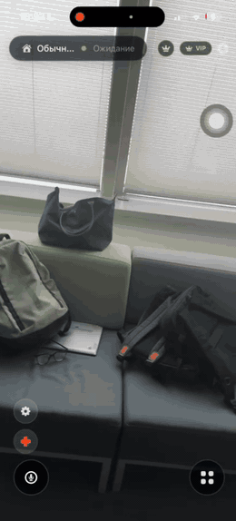

# Janarym AI

**A voice assistant for blind and visually impaired users, in Kazakh, Russian and English.**

Janarym ("my light" in Kazakh) answers spoken questions about what the camera sees. The user holds the phone, or wears an ESP32-CAM module, says "Жанарым" followed by a question, and hears the answer read back — where the door is, what is written on a medicine box, who is nearby.

> **Status:** closed beta with users at the An-Nisa Centre in Astana. iOS only.

<p align="center">
  <br>
  <em><a href="docs/janarym-demo.mp4">Watch the demo with sound (MP4)</a></em>
</p>

---

## Architecture

```
┌──────────────┐   BLE pairing + Wi-Fi MJPEG   ┌─────────────────┐
│  ESP32-CAM   │ ────────────────────────────► │                 │
│  wearable    │   /stream, /snapshot          │   iOS app       │
└──────────────┘   (Bearer token)              │   SwiftUI       │
                                               │                 │
        Apple Vision (on-device classification)│                 │
        SFSpeechRecognizer (wake word, STT)    │                 │
                                               └────────┬────────┘
                                   Firebase ID token    │
                   ┌───────────────────────────────────┼──────────────────┐
                   ▼                                   ▼                  ▼
          ┌─────────────────┐              ┌───────────────────┐  ┌──────────────┐
          │    Firebase     │              │ Cloudflare Worker │  │  Firebase    │
          │ Auth·Firestore  │              │   openai-proxy    │  │  Functions   │
          │    Storage      │              │ verifies ID token │  │ ID token +   │
          └─────────────────┘              └─────────┬─────────┘  │ env secrets  │
                                                     │            └──────────────┘
                                                     ▼
                                          ┌─────────────────────┐
                                          │       OpenAI        │
                                          │ gpt-4o-transcribe   │
                                          │ gpt-4.1-mini        │
                                          │ gpt-4o-mini-tts     │
                                          └─────────────────────┘
```

The app holds **no OpenAI key**. Every AI request carries the signed-in user's Firebase ID token and goes through the Cloudflare Worker, which verifies the token against Google's public signing keys before calling OpenAI with a key stored in Worker secrets.

| Layer | What it does |
|---|---|
| **iOS app** (SwiftUI, iOS 16+) | Camera, microphone, wake word, playback, family dashboards |
| **On-device vision** | `VNClassifyImageRequest` (Apple Vision) — an offline fallback description when the network is unavailable |
| **Speech in** | `SFSpeechRecognizer` for the wake word; `gpt-4o-transcribe` through the proxy for Kazakh and Russian |
| **Reasoning** | `gpt-4.1-mini` with the camera frame attached |
| **Speech out** | `gpt-4o-mini-tts`, with `AVSpeechSynthesizer` as the offline fallback |
| **ESP32-CAM** | Arduino/PlatformIO firmware: BLE discovery, MJPEG `/stream`, JPEG `/snapshot`, snapshot upload to Firebase |
| **Firebase** | Auth, Firestore (profiles, roles, family links, med cards), Storage, two Cloud Functions |
| **Cloudflare Worker** | Authenticated OpenAI proxy: STT → chat → TTS in one round trip |

## Features

All of the following exist in this repository:

- **Wake word "Жанарым"** — recognised across Kazakh, Russian and English speech engines, with tolerance for how each engine mangles the word ([`StringNormalizer.swift`](mobile/Core/StringNormalizer.swift))
- **Scene description** — "what is in front of me?" answered with objects, side (left/right/ahead) and distance in steps
- **Voice commands** — settings, med card, SOS, "where is my parent", navigation mode, AR-glasses mode, "where am I", read text, scan barcode, scan medicine, start/stop video, torch on/off, ask the time
- **Medication scanner** — photographs a box and returns structured medication data
- **Medical card** — medications, symptoms, emergency overlay
- **Family linking** — a child publishes a short BLE discovery code, a parent scans it and links the accounts after approval
- **Presence and SOS** — location and battery reporting, triggered by voice or by the hardware button
- **Roles** — `developer`, `admin`, `mentor`, `parent`, `child`, `member`, each with its own dashboard and Firestore rules
- **Subscription tiers** — free (5 requests/day), premium (50/day), VIP (unlimited), with camera quality tied to the tier
- **Offline fallback** — Apple Vision classification and local TTS when the proxy is unreachable
- **Accessibility-first UI** — large targets, haptics, spoken feedback on every state change

## Testing with users

Janarym was built with the people who use it.

- **480+ hours** of user research, including **84 hours** working directly with blind users and their families at the An-Nisa Centre and with a blind blogger
- **75 direct beneficiaries**, including 67 children at the An-Nisa Centre
- **Timed test with 20 users:** finding a specific room in a building took **11 minutes on average without Janarym and 4 minutes with it**

## Setup

### 1. iOS app

```bash
# The .xcodeproj is generated — it is not committed.
python3 generate_xcodeproj.py

cp mobile/Resources/Secrets.example.plist mobile/Resources/Secrets.plist
# Fill in OPENAI_PROXY_URL and ESP32_STREAM_TOKEN.

open Janarym.xcodeproj
```

You also need your own `mobile/App/GoogleService-Info.plist` from the Firebase console. Both that file and `Secrets.plist` are git-ignored.

The camera and microphone do not work in the iOS Simulator — test on a real device.

### 2. Cloudflare Worker

```bash
cd backend/workers/openai-proxy
npx wrangler secret put OPENAI_API_KEY   # never goes in wrangler.toml
npx wrangler deploy
```

`FIREBASE_PROJECT_ID` is a plain variable in `wrangler.toml`; it is not a secret.

### 3. Firebase

```bash
cd backend
firebase deploy --only firestore:rules,functions
```

The Cloud Functions read `OPENAI_API_KEY` from the environment and verify a Firebase ID token on every request.

### 4. Firmware

```bash
cd firmware
cp include/secrets.h.example include/secrets.h
# Fill in Wi-Fi, Firebase and STREAM_AUTH_TOKEN.
# STREAM_AUTH_TOKEN must match ESP32_STREAM_TOKEN in the app's Secrets.plist.

pio run --target upload
pio run --target uploadfs      # SPIFFS for the snapshot buffer
```

`pio run -e esp32cam-debug` additionally allows `?token=…` in the URL so you can open the stream in a browser. Do not flash that build to a device that leaves the bench.

## Security

- No secrets are committed. `Secrets.plist`, `GoogleService-Info.plist`, `firmware/include/secrets.h`, `.dev.vars` and service-account files are all git-ignored; only `*.example` templates with placeholders are in the repository.
- The app ships without an OpenAI key. Every AI call is authenticated with a Firebase ID token and proxied.
- The Cloudflare Worker verifies the RS256 signature, issuer, audience and expiry of every ID token before it spends a single OpenAI credit, and accepts only an allowlist of models.
- Firestore rules prevent a user from granting themselves a privileged `role`, restrict every collection by role and ownership, and block enumeration of discovery tokens.
- The ESP32-CAM requires a bearer token on `/stream` and `/snapshot`.

### Known limitations

- **Wi-Fi credentials are compiled into the firmware.** They are kept out of the repository in a git-ignored `secrets.h`, but they still live in the flashed binary. BLE provisioning at first boot is the proper fix and is not implemented yet.
- **The ESP32 stream token ships inside the app bundle.** It stops anonymous access to the camera on the local network, but a determined attacker can extract it, and rotating it means reflashing the device.
- **No per-user rate limiting in the proxy.** Daily request quotas are enforced in the app, which is client-side only; moving them into the Worker needs KV or a Durable Object.

## Project layout

```
mobile/                 iOS app (SwiftUI)
  Core/                 config, errors, language resolution, wake word matching
  Features/             auth, assistant, camera, med card, family, settings…
  Services/             Firebase, OpenAI proxy client, ESP32 camera, BLE, speech
firmware/               ESP32-CAM (PlatformIO, Arduino)
backend/
  functions/            Firebase Cloud Functions
  workers/openai-proxy/ Cloudflare Worker — authenticated OpenAI proxy
  firestore.rules       Firestore security rules
generate_xcodeproj.py   generates Janarym.xcodeproj from mobile/
```

## Team

Janarym is developed by the Enactus team at Astana IT University College.

- Technovation Girls 2026 — Global Semifinalist
- Enactus Kazakhstan National Cup — 2nd Place, Early Stage League; selected for the Enactus World Cup 2026 (São Paulo)

## Contact

Yerkezhan Abil — erkezhanabil@gmail.com · [LinkedIn](https://www.linkedin.com/in/erkezhanabil)
